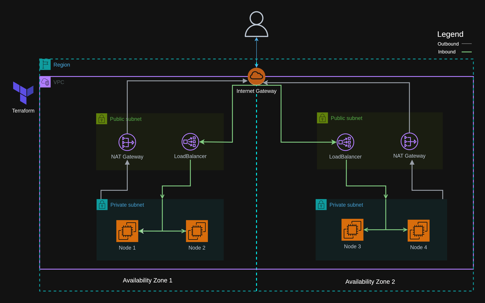
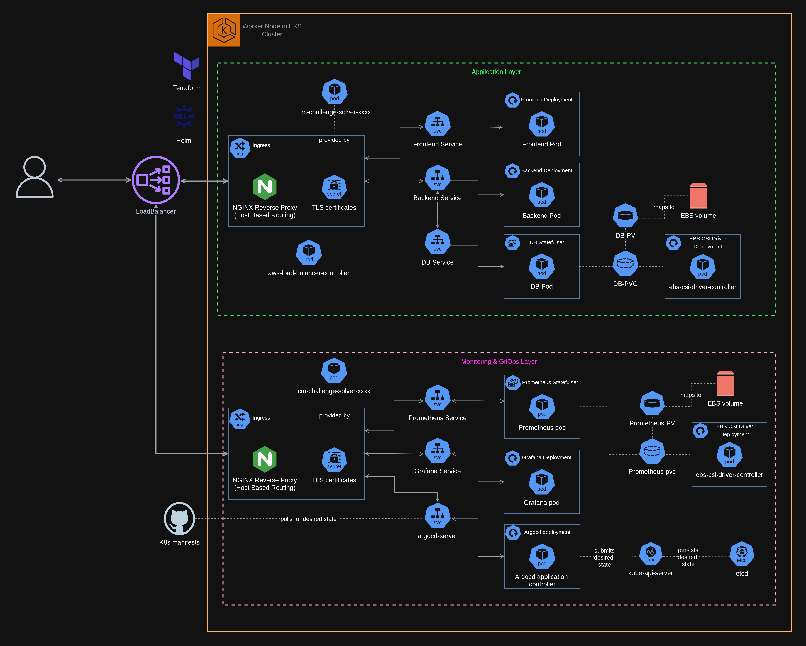
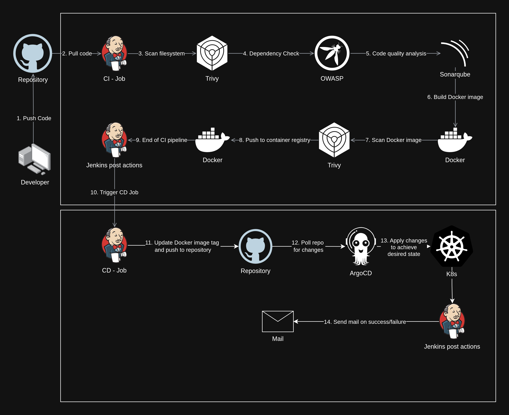

# 🚀 Cloud Native Deployment: Fullstack application on AWS EKS

This project details the **DevOps** and **Cloud Engineering** practices used to deploy a full-stack application onto **Amazon Web Services (AWS)** using **Elastic Kubernetes Service (EKS)**. The focus is on implementing **Infrastructure as Code (IaC)**, achieving a robust **CI/CD pipeline** with **Jenkins**, and ensuring security through fine-grained access control and strategic network segmentation.

---

## 📋 Table of Contents

- [AWS EKS Architecture & Networking](#-aws-eks-architecture--networking)
- [Security & Access Control](#-security--access-control)
- [CI/CD Pipeline with Jenkins](#-cicd-pipeline-with-jenkins)
- [Observability & Scaling](#-observability--scaling)

---

## 1. ☁️ AWS EKS Architecture & Networking

The core infrastructure resides in a dedicated AWS VPC, built with high security and scalability principles in mind.

### 1.1. Core Infrastructure & IaC

| Component | Technology | Rationale & Learning |
|:----------|:-----------|:---------------------|
| **Infrastructure as Code (IaC)** | **Terraform** | **Critical Lesson Learned:** Manually configuring the VPC, subnets, and EKS cluster was quickly deemed unscalable and error-prone. Adopting Terraform provided a **repeatable, auditable, and version-controlled** blueprint for the entire environment, accelerating development and recovery. |
| **Networking Topology** | Custom VPC, Public & Private Subnets | Designed for multi-AZ redundancy and security. All compute instances are isolated. |
| **Cost Management** | Single NAT Gateway & Load Balancer | To **save costs** in development/staging, only a **single NAT Gateway** was deployed. **NOTE:** The production strategy mandates **one NAT Gateway per Availability Zone (AZ)** for fault tolerance, and the Load Balancer setup should also ensure cross-AZ deployment for true High Availability (HA). |

### 1.2. Strategic Node Placement & Load Balancer Provisioning

#### **A. EKS Worker Nodes in Private Subnets**

- **Implementation:** The EKS Worker Nodes, which host all application, database (MongoDB), and monitoring pods, are provisioned **exclusively in private subnets**.
- **Security Significance:** This is a fundamental security practice. It ensures that the compute layer is **not directly exposed to the public internet**. All incoming internet traffic must be funneled through the highly controlled **Ingress** layer, minimizing the cluster's attack surface.

#### **B. Load Balancer Provisioning and Secure Ingress**

- **Load Balancer Provisioning:** The Kubernetes **Nginx Ingress Controller** is exposed via a service of type `LoadBalancer`. This automatically triggers the provisioning of an **AWS Network Load Balancer (NLB)**, which acts as the entry point for all external traffic.
- **Custom Domain & Security:** The application is exposed on a **custom domain** (e.g., `app.mycustomdomain.com`).
  - **HTTPS Security:** **Cert-Manager** is deployed to automatically provision and manage free, trusted **TLS/SSL certificates** (e.g., Let's Encrypt), securing all communication to the application over HTTPS.

---

## 2. 🛡️ Security & Access Control

Security was prioritized using cloud-native Kubernetes best practices, focusing on the **Principle of Least Privilege**.

### 2.1. EKS Pod Identity (IRSA) Implementation

- **Problem:** Traditional Kubernetes required granting broad IAM permissions to the EKS node group, which violated the Principle of Least Privilege.
- **Solution:** **EKS Pod Identity (formerly IRSA - IAM Roles for Service Accounts)** was implemented.
- **Mechanism:** This maps specific **AWS IAM Roles** directly to individual Kubernetes **Service Accounts**. This means only the Pods that absolutely require AWS API access (e.g., the Load Balancer Controller, the EBS CSI Driver) receive those permissions, ensuring only the necessary credentials are in scope at the Pod level.

### 2.2. Docker Best Practice

- **Multi-Stage Builds:** **Dockerfiles** utilize multi-stage builds to separate build dependencies from the runtime environment. This results in minimal production images.

---

## 3. ⚙️ CI/CD Pipeline with Jenkins

The CI/CD process is automated through a Jenkins pipeline, handling everything from code check-in to production-ready image deployment, leveraging a **GitOps** approach for the final push.

### 3.1. Jenkins Flow Diagram

### 3.2. Key Pipeline Features

| Stage | Detail | Functionality |
|:------|:-------|:--------------|
| **Containerization** | Multi-Stage Docker Builds | Build optimized, minimal images for both Node.js Backend and React Frontend. |
| **Quality Gates** | Code Scanning, Unit/Integration Tests | Ensures image and code quality before promotion. |
| **Continuous Integration (CI)** | Image Tagging & Push | Builds artifact (Docker images), tags with unique ID, and pushes to Docker Registry. |
| **Continuous Delivery (CD)** | GitOps Manifest Update | The CI stage triggers a CD process that updates the image tag within the K8s deployment manifests in a **GitOps repository**. The cluster then pulls the changes automatically. |
| **Notifications** | Email Integration | **Jenkins is configured to send automated messages (email)** upon both **build success** and **build failure**, providing immediate feedback to the development team. |

---

## 4. 📈 Observability & Scaling

### 4.1. Monitoring Stack

- **Components:** Deployed the **Prometheus** and **Grafana** stack using the `kube-prometheus-stack` Helm chart.
- **Custom Application Metrics:**
  - The Node.js backend exposes custom metrics (request count, latency, HTTP errors) on the **`/metrics`** endpoint using a client library.
  - A **ServiceMonitor** Kubernetes resource is configured to instruct Prometheus to **scrape** these custom application metrics from the backend Pods.
  - A **custom Grafana dashboard** was created specifically to visualize these Node.js backend metrics.

### 4.2. Scaling Strategy

- **HPA Implementation:** The **Horizontal Pod Autoscaler (HPA)** was implemented on the Backend Deployment.
- **Functionality:** The HPA automatically scales the number of backend Pod replicas up or down based on observed resource utilization (e.g., maintaining average Pod CPU utilization below 70%).

### 4.3. Current Shortcoming: Insecure Dashboard Access ⚠️

- **Problem:** Although **Cert-Manager** was used to successfully secure communication to the Grafana and Prometheus dashboards with HTTPS, **access could not be effectively restricted**.
- **Impact:** The dashboards are encrypted, but they lack a robust **authentication layer**, making them publicly accessible (or restricted only by a basic IP whitelist), which is highly insecure for production monitoring tools.
- **Next Steps:** The primary enhancement required is to implement an **authentication proxy** (e.g., OAuth2 Proxy) or configure the Ingress Controller to enforce a login requirement for the monitoring sub-domains.

---

## 🎯 Key Achievements

- ✅ Fully automated infrastructure provisioning with Terraform
- ✅ Secure, multi-layered network architecture with private subnets
- ✅ Principle of Least Privilege through EKS Pod Identity
- ✅ Comprehensive CI/CD pipeline with GitOps deployment
- ✅ Production-grade monitoring and auto-scaling capabilities
- ✅ HTTPS encryption across all endpoints

## 🔮 Future Enhancements

- [ ] Implement OAuth2 Proxy for dashboard authentication
- [ ] Deploy multi-AZ NAT Gateways for production HA
- [ ] Add a CDN, API Gateway
- [ ] Implement backup and disaster recovery procedures
- [ ] Implement RBAC for cluster access

---

> **Note:** Architecture diagrams are available in both png and svg formats. 

> [!CAUTION] DOMAIN DEPENDENCY REQUIRED
> This architecture is configured for a **custom domain** (`app.mydomain.co.in`) and relies heavily on **Cert-Manager** to provision HTTPS certificates via Let's Encrypt.
>
> If you clone this repository and attempt to run the CI/CD pipeline:
> 1.  You **must** provision a real domain (or sub-domain) and update all Kubernetes manifests (`ingress.yaml`, `ingress-monitoring.yaml`) and your Terraform configuration to match.
> 2.  Attempting to use a fake domain will cause **Cert-Manager** to fail its challenge, and the application will remain inaccessible over HTTPS.
